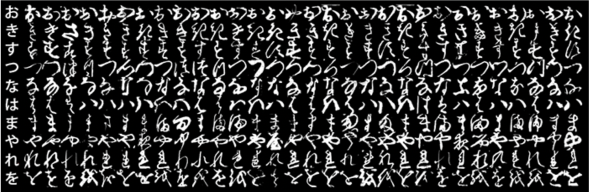
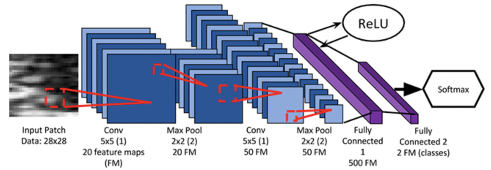

# PyTorch: Training your first Convolutional Neural Network

In this tutorial, you will receive a gentle introduction to training your first Convolutional Neural Network(CNN) using the PyTorch deep learning library. This network will be able to recognize handwritten Hiragana characters.
That tutorial focused on simple numerical data. we will take the next step and learn how to train a CNN to recognize handwritten Hiragana characters using the Kuzushiji-MNIST (KMNIST) dataset.

As you’ll see, training a CNN on an image dataset isn’t all that different from training a basic multi-layer perceptron (MLP) on numerical data. We still need to: 

	1.	Define our model architecture
	2.	Load our dataset from disk
	3.	Loop over our epochs and batches
	4.	Make predictions and compute our loss
	5.	Properly zero our gradient, perform backpropagation, and update our model parameters

Furthermore, this post will also give you some experience with PyTorch’s `DataLoader` implementation which makes it super easy to work with datasets --- becoming proficient with PyTorch’s `DataLoader` is a critical skill you’ll want to develop as a deep learning practitioner. 

To learn how to train your first CNN with PyTorch, just keep reading. Throughout the reminder of this tutorial, you will learn how to train your first CNN using the PyTorch framework.
We’ll start by configuring our development environment to install both torch and torchvision, followed by reviewing our project directory structure.
I’ll then show you the KMNIST dataset (a drop-in replacement for the MNIST digits dataset) that contains Hiragana characters. Later in this tutorial, you’ll learn how to train a CNN to recognize each of the Hiragana characters in the KMNIST dataset.
We’ll then implement three Python scripts with PyTorch, including our CNN architecture, training script, and a final script used to make predictions on input images. 
Configuring your development environment to follow this guide, you need to have PyTorch, OpenCV, and scikit-learn installed on your system.Luckily, all three are extremely easy to install pip:

PyTorch: Training your first Convolutional Neural Network (CNN)
```bash
$ pip install torch torchvision
$ pip install opencv-contrib-python
$ pip install scikit-learn
```
**If you need help configuring your development environment for PyTorch, I highly recommend that you read the PyTorch documentation** --- PyTorch’s documentation is comprehensive and will have you up and running quickly.

## The KMNIST dataset
<figure>

	<span style="font-size: 0.8em; color:gray;"><figcaption align="center">
		"Figure 1: The KMNIST dataset is a drop-in replacement for the standard MNIST dataset. The KMNIST dataset contains examples of handwritten Hiragana characters."
	</figcaption></span>
</figure>


The dataset we are using today is the Kuzushiji-MNIST dataset, or KMNIST, for short. This dataset is meant to be a drop-in replacement for the standard MNIST digits recognition dataset.

The KMNIST dataset consists of 70,000 images and their corresponding labels (60,000 for training and 10,000 for testing).

There are a total of 10 classes (meaning 10 Hiragana characters) in the KMNIST dataset, each equally distributed and represented. Our goal is to train a CNN that can accurately classify each of these 10 characters.

And lucky for us, the KMNIST dataset is built into PyTorch, making it super easy for us to work with!

## Project structure
Before we start implementing and PyTorch code, let’s first review our project directory structure.

You’ll then be presented with the following directory structure:
```bash
$ tree . --dirsfirst
.
├-- output
│       ├-- model.pth
│       └-- plot.png
├-- moduels
│       ├-- __init__.py
│       └-- lenet.py
├-- predict.py
└---- train.py
2 directories, 6 files
```

We have three Python scripts to review today:  

	1.	`lenet.py`: Our PyTorch implementation of the famous LeNet architecture  
	2.	`train.py`: Trains LeNet on the KMNIST dataset using PyTorch, then serializes the trained model to disk(i.e., model.pth)  
	3.	`predict.py`: Loads our trained model from disk, makes predictions on testing images, and displays the results on our screen  

The output directory will be populated with plot.png (a plot of our training/validation loss and accuracy) and model.pth (our trained model file) once we run train.py

With our project directory structure reviewed, we can move on to implementing our CNN with PyTorch.

## Implementing a Convolutional Neural Network (CNN) with PyTorch
<figure>

	<span style="font-size: 0.8em; color:gray;"><figcaption align="center">
		Figure 2: The LeNet architecture. We’ll be implementing LeNet with PyTorch
	</figcaption></span>
</figure>

The Convolutional Neural Network(CNN) we are implementing here with PyTorch is the seminal LeNet architecture, first proposed by one of the grandfathers of deep learning, Yann LeCunn.

By today’s standards, LeNet is a *very shallow* neural network, consisting of the following layers:

	(CONV => RELU => POOL) * 2 => FC => RELU => FC => SOFTMAX

As you’ll see, we’ll be able to implement LeNet with PyTorch in only 60 lines of code (including comments).

The best way to learn about CNNs with PyTorch is to implement one, so with that said, open the `lenet.py` file in the `modules` module, and let’s get to work:

PyTorch: Training your first Convolutional Neural Network (CNN)

```python
# import the necessary packages
from torch.nn import Module
from torch.nn import Conv2d
from torch.nn import Linear
from torch.nn import MaxPool2d
from torch.nn import ReLU
from torch.nn import LogSoftmax
from torch import flatten
```

**Lines 2-8** import our required packages. Let’s break each of them down:

	* `Module`: Rather than using the `Sequential` PyTorch class to implement LeNet, we'll instead subclass the Module object so you can see how PyTorch implements neural networks using classes

# torch
