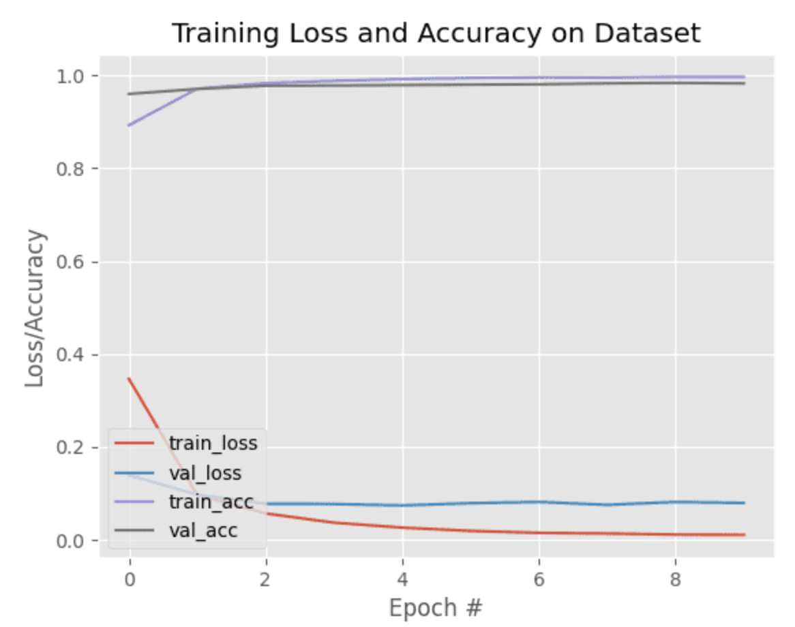
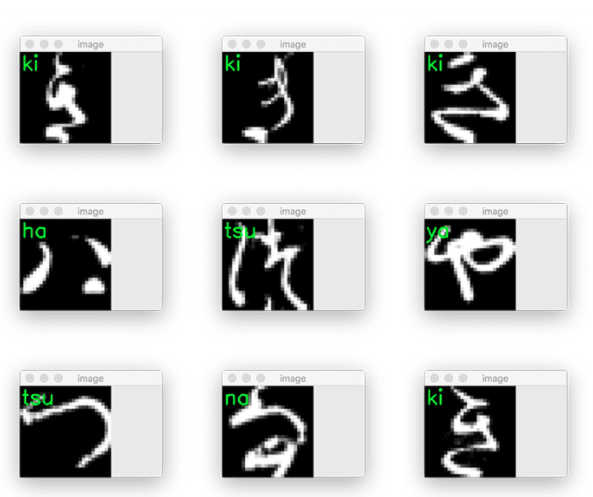

# PyTorch: Training your first Convolutional Neural Network

## Title
[Intro](#Intro)  
[The KMNIST dataset](#The-KMNIST-dataset)
[Project structure](#Project-structure)  
[Implementing a Convolutional Neural Network (CNN) with PyTorch](#Implementing-a-Convolutional-Neural-Network-(CNN)-with-PyTorch)  
[Creating our CNN training script with PyTorch](#Creating-our-CNN-training-script-with-PyTorch)  
[Training our CNN with PyTorch
](#Training-our-CNN-with-PyTorch)  
[Implementing our PyTorch prediction script](#Implementing-our-PyTorch-prediction-script)  
[Making predictions with our trained PyTorch model](#Making-predictions-with-our-trained-PyTorch-model)

## Intro
In this tutorial, you will receive a gentle introduction to training your first Convolutional Neural Network(CNN) using the PyTorch deep learning library. This network will be able to recognize handwritten Hiragana characters.
That tutorial focused on simple numerical data. we will take the next step and learn how to train a CNN to recognize handwritten Hiragana characters using the Kuzushiji-MNIST (KMNIST) dataset.

As you’ll see, training a CNN on an image dataset isn’t all that different from training a basic multi-layer perceptron (MLP) on numerical data. We still need to: 

	1. Define our model architecture
	2. Load our dataset from disk
	3. Loop over our epochs and batches
	4. Make predictions and compute our loss
	5. Properly zero our gradient, perform backpropagation, and update our model parameters

Furthermore, this post will also give you some experience with PyTorch’s `DataLoader` implementation which makes it super easy to work with datasets --- becoming proficient with PyTorch’s `DataLoader` is a critical skill you’ll want to develop as a deep learning practitioner. 

To learn how to train your first CNN with PyTorch, just keep reading. Throughout the reminder of this tutorial, you will learn how to train your first CNN using the PyTorch framework.
We’ll start by configuring our development environment to install both torch and torchvision, followed by reviewing our project directory structure.
I’ll then show you the KMNIST dataset (a drop-in replacement for the MNIST digits dataset) that contains Hiragana characters. Later in this tutorial, you’ll learn how to train a CNN to recognize each of the Hiragana characters in the KMNIST dataset.
We’ll then implement three Python scripts with PyTorch, including our CNN architecture, training script, and a final script used to make predictions on input images. 
Configuring your development environment to follow this guide, you need to have PyTorch, OpenCV, and scikit-learn installed on your system.Luckily, all three are extremely easy to install pip:

PyTorch: Training your first Convolutional Neural Network (CNN)
```bash
$ pip install torch torchvision
$ pip install opencv-contrib-python
$ pip install scikit-learn
```
**If you need help configuring your development environment for PyTorch, I highly recommend that you read the PyTorch documentation** --- PyTorch’s documentation is comprehensive and will have you up and running quickly.

## The KMNIST dataset
<figure>

	<span style="font-size: 0.8em; color:gray;"><figcaption align="center">
		Figure 1: The KMNIST dataset is a drop-in replacement for the standard MNIST dataset. The KMNIST dataset contains examples of handwritten Hiragana characters.
	</figcaption></span>
</figure>


The dataset we are using today is the Kuzushiji-MNIST dataset, or KMNIST, for short. This dataset is meant to be a drop-in replacement for the standard MNIST digits recognition dataset.

The KMNIST dataset consists of 70,000 images and their corresponding labels (60,000 for training and 10,000 for testing).

There are a total of 10 classes (meaning 10 Hiragana characters) in the KMNIST dataset, each equally distributed and represented. Our goal is to train a CNN that can accurately classify each of these 10 characters.

And lucky for us, the KMNIST dataset is built into PyTorch, making it super easy for us to work with!

## Project structure
Before we start implementing and PyTorch code, let’s first review our project directory structure.

You’ll then be presented with the following directory structure:
```bash
$ tree . --dirsfirst
.
├-- output
│       ├-- model.pth
│       └-- plot.png
├-- moduels
│       ├-- __init__.py
│       └-- lenet.py
├-- predict.py
└---- train.py
2 directories, 6 files
```

We have three Python scripts to review today:  

> 1. `lenet.py`: Our PyTorch implementation of the famous LeNet architecture  
> 2. `train.py`: Trains LeNet on the KMNIST dataset using PyTorch, then serializes the trained model to disk(i.e., model.pth)  
> 3. `predict.py`: Loads our trained model from disk, makes predictions on testing images, and displays the results on our screen  

The output directory will be populated with plot.png (a plot of our training/validation loss and accuracy) and model.pth (our trained model file) once we run train.py

With our project directory structure reviewed, we can move on to implementing our CNN with PyTorch.

## Implementing a Convolutional Neural Network (CNN) with PyTorch
<figure>

	<span style="font-size: 0.8em; color:gray;"><figcaption align="center">
		Figure 2: The LeNet architecture. We’ll be implementing LeNet with PyTorch
	</figcaption></span>
</figure>

The Convolutional Neural Network(CNN) we are implementing here with PyTorch is the seminal LeNet architecture, first proposed by one of the grandfathers of deep learning, Yann LeCunn.

By today’s standards, LeNet is a *very shallow* neural network, consisting of the following layers:

	(CONV => RELU => POOL) * 2 => FC => RELU => FC => SOFTMAX

As you’ll see, we’ll be able to implement LeNet with PyTorch in only 60 lines of code (including comments).

The best way to learn about CNNs with PyTorch is to implement one, so with that said, open the `lenet.py` file in the `modules` module, and let’s get to work:

PyTorch: Training your first Convolutional Neural Network (CNN)

```python
# import the necessary packages
from torch.nn import Module
from torch.nn import Conv2d
from torch.nn import Linear
from torch.nn import MaxPool2d
from torch.nn import ReLU
from torch.nn import LogSoftmax
from torch import flatten
```
import our required packages. Let’s break each of them down:

> * `Module`: Rather than using the `Sequential` PyTorch class to implement LeNet, we'll instead subclass the Module object so you can see how PyTorch implements neural networks using classes
> * `Conv2d` : PyTorch's implementation of convolutional layers
> * `Linear` : Fully connected layers
> * `MaxPool2d` : Applies 2D max-pooling to reduce the spatital dimensions of the input volume
> * `ReLU`: Our ReLU activation function
> * `LogSoftmax` : Used when building our softmax classifier to return the predicted probabilities of each class
>* `flatten` : Flattens the output of a multi-dimensional volume (e.g., a CONV or POOL layer) such that we can apply fully connected layers to it

With our imports taken care of, we can implement our `LeNet` class using PyTorch:

```python
class LeNet(Module):
	def __init__(self, numChannels, classes):
		# call the parent constructor
		super(LeNet, self).__init__()

		# initialize first set of CONV => RELU => POOL layers
		self.conv1 = Conv2d(in_channels=numChannels, out_channels=20,
			kernel_size=(5, 5))
		self.relu1 = ReLU()
		self.maxpool1 = MaxPool2d(kernel_size=(2, 2), stride=(2, 2))

		# initialize second set of CONV => RELU => POOL layers
		self.conv2 = Conv2d(in_channels=20, out_channels=50,
			kernel_size=(5, 5))
		self.relu2 = ReLU()
		self.maxpool2 = MaxPool2d(kernel_size=(2, 2), stride=(2, 2))

		# initialize first (and only) set of FC => RELU layers
		self.fc1 = Linear(in_features=800, out_features=500)
		self.relu3 = ReLU()

		# initialize our softmax classifier
		self.fc2 = Linear(in_features=500, out_features=classes)
		self.logSoftmax = LogSoftmax(dim=1)
```
**Line 1** defines the `Lenet` class. Notice how we are subclassing the `Module` object object -- by building our model as a class we can easily

* Reuse variables
* Implement custom functions to generate subnetworks/components(used *very often* when implementing more complex networks, such as ResNet, Inception, etc.)
* Define our own `forward` pass function

**best of all, when defined correctly, PyTorch can automatically apply its autograd module to perform automatic differentiation -- backpropagation is taken care of for us by virtue of the PyTorch library!**  

The constructor to `LeNet` accepts two variables:

> 1. `numChannels` : The number of channels in the input images (`1` for grayscale or `3` for RGB)
> 2. `classes` : Total number of unique class labels in our dataset 

* calls the parent constructor (i.e., `Module`) which performs a number of PyTorch-specific operations.

* calls the parent constructor (i.e., `Module`) which performs a number of PyTorch-specific operations.

* Initialize our first set of `CONV => RELU => POOL` layers. Our first CONV layer learns a total of 20 filters, each of which are *5 $\times$ 5*. A ReLU activation function is then applied, followed by a *2 \times 2* max-pooling layer with a *2 $\times$ 2*stride to reduce the spatital dimensions of our input image.

We then have a second set of `CONV => RELU => POOL` layers. We increase the number of filters learned in the CONV layer to 50, but maintain the *5 $\times$ 5* kernel size. Again, a ReLU activation is applied, followed by max-pooling.

Next comes our first and only set of fully connected layers. We define the number of inputs to the layer (`800`) along with our desired number of output nodes (`500`). A ReLU activation follows the FC layer.

Finally, we apply our softmax classifier. The number of `in_features` is set to `500`, which is the *output* dimensionality from the previous layer. We then apply `LogSoftmax` such that we can obtain predicted probabilities during evaluation.

**To build the network architecture itself (i.e, what layer is input to some other layer), we need to override the `forward` method method of the `Module` class**.

The `forward` function serves a number of purpose:  
1. It connects layers/subnetworks together from variables defined in the constructor (i.e, \_\_init__) of the class
2. It defines the network architecture itself
3. It allows the forward pass of the model to be performed, resulting in our output predictions
4. And, thanks to PyTorch's autograd module, it allows us to perform automatic differentiation and update our model weights.

```python
	def forward(self, x):
		# pass the input through our first set of CONV => RELU =>
		# POOL layers
		x = self.conv1(x)
		x = self.relu1(x)
		x = self.maxpool1(x)

		# pass the output from the previous layer through the second
		# set of CONV => RELU => POOL layers
		x = self.conv2(x)
		x = self.relu2(x)
		x = self.maxpool2(x)

		# flatten the output from the previous layer and pass it
		# through our only set of FC => RELU layers
		x = flatten(x, 1)
		x = self.fc1(x)
		x = self.relu3(x)

		# pass the output to our softmax classifier to get our output
		# predictions
		x = self.fc2(x)
		output = self.logSoftmax(x)

		# return the output predictions
		return output
```

The `forward` method accepts a single parameter, `x`, which is the batch of input data to the network.

We then connect our `conv1`, `relu1`, and `maxpool1` layers together to form the first `CONV => RELU => POOL` layer of the network.

A similar operation is performed, this time building the second set of `CONV => RELU => POOL` layers.  

At this point, the variable `x` is a multi-dimensional tensor; however, in order to create our fully connected layers, we need to "flatten" this tensor into what essentially amounts to a 1D list of values --- the `flatten` function takes care of this operation for us.

From there, we connect the `fc1` and `relu3` layers to the network architecture, followed by attaching the final `fc2` and `logSoftmax`.

The `output` of the network is then returned to the calling function.  

**Again, I want to reiterate the importance of *initializing variables in the constructor* versus *building the netowrk itself in the `forward` function:***

* The constructor to your `Module` only initializes your layers types. PyTorch keeps track of these variables, but it has no idea how the layers connect to each other.

* For PyTorch to understand the network architecture you're building, you define the `forward` function.  

* Inside the `forward` function you take the variables initialized in your constructor and connect them.

* PyTorch can then make predictions using your network and perform automatic backpropagation, thanks to the autograd module

## Creating our CNN training script with PyTorch

With our CNN architecture implemented, we can move on to creating our training script with PyTorch.

Open the `train.py` file in your project directory structure, and let's get to work:

```python
# set the matplotlib backend so figures can be saved in the background
import matplotlib
matplotlib.use("Agg")

# import the necessary packages
from pyimagesearch.lenet import LeNet
from sklearn.metrics import classification_report
from torch.utils.data import random_split
from torch.utils.data import DataLoader
from torchvision.transforms import ToTensor
from torchvision.datasets import KMNIST
from torch.optim import Adam
from torch import nn
import matplotlib.pyplot as plt
import numpy as np
import argparse
import torch
import time
```

Import `matplotlib` and set the appropriate background engine.

From there, we import a number of notable packages:  

* `Lenet`: Our PyTorch implementation of the LeNet CNN from the previous section  
* `classification_report`: Used to display a detailed classification report on our testing set
* `random_split`: Constructs a random training/testing split from an input set of data
* `DataLoader`: PyTorch's *awesome* data loading utility that allows us to effortlessly build data pipelines to train our CNN
* `ToTensor`: A preprocessing function that converts input data into a PyTorch tensor for us automatically
* `KMNIST`: The Kuzushiji-MNIST dataset loader built into the PyTorch library
* `Adam`: The optimizer we'll use to train our neural nework
* `nn`: PyTorch's neural network implementations

<br>

```python
# construct the argument parser and parse the arguments
ap = argparse.ArgumentParser()
ap.add_argument("-m", "--model", type=str, required=True,
	help="path to output trained model")
ap.add_argument("-p", "--plot", type=str, required=True,
	help="path to output loss/accuracy plot")
args = vars(ap.parse_args())
```

We have two command line arguments that need parsing:
1. `--model`: The path to our output serialized model after training(we save this model to disk so we can use it to make predictions in our `predict.py` script)

2. `--plot`: The path to our output training history plot

Moving on, we now have some important initialization to take care of:

```python
# define training hyperparameters
INIT_LR = 1e-3
BATCH_SIZE = 64
EPOCHS = 10

# define the train and val splits
TRAIN_SPLIT = 0.75
VAL_SPLIT = 1 - TRAIN_SPLIT

# set the device we will be using to train the model
device = torch.device("cuda" if torch.cuda.is_available() else "cpu")
```

<br>

Set our initial learning rate, batch size, and number of epochs to tarin for, while it defines our training and validation split size(75% of training, 25% for validation).

`device` variable  then determines our `device`(i.e., whether we'll be using our CPU or GPU).

<br>

```python
# load the KMNIST dataset
print("[INFO] loading the KMNIST dataset...")
trainData = KMNIST(root="data", train=True, download=True,
	transform=ToTensor())
testData = KMNIST(root="data", train=False, download=True,
	transform=ToTensor())

# calculate the train/validation split
print("[INFO] generating the train/validation split...")
numTrainSamples = int(len(trainData) * TRAIN_SPLIT)
numValSamples = int(len(trainData) * VAL_SPLIT)
(trainData, valData) = random_split(trainData,
	[numTrainSamples, numValSamples],
	generator=torch.Generator().manual_seed(42))
```

above code load the KMNISt dataset using PyTorch's build in `KMNIST` class.

For our `trainData`, we set `train=True` while our `testData` is loaded iwth `train=False`. These Booleans come in handy when working with datasets built into the PyTorch library.

The `download=True` flag indicates that PyTorch will automatically download and cache the KMNIST dataset to disk for us if we had not previously downloaded it.

Also take note of the `transform` parameter --- here we can apply a number of data transformations (outside the scope of this tutorial but will be covered soon). The only transform we need is to convert the NumPy array loaded by PyTorch into a tensor data type.

With our training and testing set loaded, we drive our training and validation set on `calculate the train/validation split`. Using PyTorch's `random_split` funcion, we can easily split our data.

We now have three sets of data:  
1. Training
2. Validation
3. Testing

```python
# initialize the train, validation, and test data loaders
trainDataLoader = DataLoader(trainData, shuffle=True,
	batch_size=BATCH_SIZE)
valDataLoader = DataLoader(valData, batch_size=BATCH_SIZE)
testDataLoader = DataLoader(testData, batch_size=BATCH_SIZE)

# calculate steps per epoch for training and validation set
trainSteps = len(trainDataLoader.dataset) // BATCH_SIZE
valSteps = len(valDataLoader.dataset) // BATCH_SIZE
```

Building the `DataLoader` objects is accomplished. We set `shuffle=True` only for our `trainDataLoader` since our validation and testing sets do not requires shuffling.

We also derive the number of training steps and validation stpes per epoch.

At this point our data is ready for training; however, we don't have ad model to train yet!

```python
# initialize the LeNet model
print("[INFO] initializing the LeNet model...")
model = LeNet(
	numChannels=1,
	classes=len(trainData.dataset.classes)).to(device)

# initialize our optimizer and loss function
opt = Adam(model.parameters(), lr=INIT_LR)
lossFn = nn.NLLLoss()

# initialize a dictionary to store training history
H = {
	"train_loss": [],
	"train_acc": [],
	"val_loss": [],
	"val_acc": []
}

# measure how long training is going to take
print("[INFO] training the network...")
startTime = time.time()
```

This code block initialize our `model`. Since the KMNIST dataset is grayscale, we set `numChannels=1`. We can easily set the number of `classes` by calling `dataset.classes` of our `trainData`.

We also call `to(device)` to move the `model` to eigher our CPU or GPU.

`opt`, `lossFn` initialize our optimizer and loss function. We'll use the Adam optimizer for training and the negative log-likelihood for our loss function.

**When we combine the `nn.NLLoss` class with `LogSoftmax` in our model definition, we arrive at categorical cross-entropy loss(which is the equivalent to training a model with an output `Linear` layer and an `nn.CrossEntropyLoss` loss).**Basically, PyTorch allows you to implement categorical cross-entropy in two separate ways.

Get used to seeing both methods as some seep learning practitioners(almost arbitrarily) prefer one over the other.

We then initialize `H`, our training history dictonary. After every epoch we'll update this dictionary with our training loss, training accuracy, testing loss, and testing accuracy for the given epoch.

Finally, we start a timer to measure how long training takes `startTime`.

At this point, all of our initializations are completes, so it's time to train our model.

```python
# loop over our epochs
for e in range(0, EPOCHS):
	# set the model in training mode
	model.train()

	# initialize the total training and validation loss
	totalTrainLoss = 0
	totalValLoss = 0

	# initialize the number of correct predictions in the training
	# and validation step
	trainCorrect = 0
	valCorrect = 0

	# loop over the training set
	for (x, y) in trainDataLoader:
		# send the input to the device
		(x, y) = (x.to(device), y.to(device))

		# perform a forward pass and calculate the training loss
		pred = model(x)
		loss = lossFn(pred, y)

		# zero out the gradients, perform the backpropagation step,
		# and update the weights
		opt.zero_grad()
		loss.backward()
		opt.step()

		# add the loss to the total training loss so far and
		# calculate the number of correct predictions
		totalTrainLoss += loss
		trainCorrect += (pred.argmax(1) == y).type(
			torch.float).sum().item()
```

We loop over our desired number of epochs.

We then proceed to:  
1. Put the model in `train()` mode
2. Initialize our training loss and validation loss for the current epoch
3. Initialize our number of correct training and validation predictions for the current epoch

second `for loop` shows the benefit of using PyTorch's `DataLoader` class - all we have to do is start a `for` loop over the `DataLoader` object. PyTroch *automatically* yields a batch of training data. Under the hood, the `DataLoader` is also shuffling our training data (and if we were doing any additional preprocessing or data augmentation, it would happen here as well).

For eash batch of data we perform a forward pass, obtain our predictions, and compute the loss.

**Next comes the all *important* step of**:  
1. Zeroing our gradient
2. Performing backpropagation
3. Updating the weights of our model

**Seriously, don't forget this step!** Failure to do those three stpes *in that exact order* will lead to erroneous training results. Whenever you write a training loop with PyTorch, I highly recommend you insert those three lines of code *before you do anything else* so that you are reminded to ensure they are in the proper place.

We wrap up the code block by updating our `totalTrainLoss` and `trainCorrect` bookkeeping variables.

At this point, we've looped over all batches of data in our training set for the current epoch -- now we can evaluate our model on the validation set:
```python
	# switch off autograd for evaluation
	with torch.no_grad():
		# set the model in evaluation mode
		model.eval()

		# loop over the validation set
		for (x, y) in valDataLoader:
			# send the input to the device
			(x, y) = (x.to(device), y.to(device))

			# make the predictions and calculate the validation loss
			pred = model(x)
			totalValLoss += lossFn(pred, y)

			# calculate the number of correct predictions
			valCorrect += (pred.argmax(1) == y).type(
				torch.float).sum().item()
```

When evaluating a PyTorch model on a validation or testing set, you need to first:

1. Use the `torch.no_grad()` context to turn off gradient tracking and computation
2. Put the model in `eval()` mode

From there, you loop over all validation `DataLoader`, move the data to the correct `device`, and use the data to make predictions and compute your loss.

You can then derive your total number of correct predictions

```python
# calculate the average training and validation loss
	avgTrainLoss = totalTrainLoss / trainSteps
	avgValLoss = totalValLoss / valSteps

	# calculate the training and validation accuracy
	trainCorrect = trainCorrect / len(trainDataLoader.dataset)
	valCorrect = valCorrect / len(valDataLoader.dataset)

	# update our training history
	H["train_loss"].append(avgTrainLoss.cpu().detach().numpy())
	H["train_acc"].append(trainCorrect)
	H["val_loss"].append(avgValLoss.cpu().detach().numpy())
	H["val_acc"].append(valCorrect)

	# print the model training and validation information
	print("[INFO] EPOCH: {}/{}".format(e + 1, EPOCHS))
	print("Train loss: {:.6f}, Train accuracy: {:.4f}".format(
		avgTrainLoss, trainCorrect))
	print("Val loss: {:.6f}, Val accuracy: {:.4f}\n".format(
		avgValLoss, valCorrect))
```
`avgTrainLoss` and `avgValLoss` compute our average training and validation loss. `trainCorrect` and `valCorrect` do the same thing, but for our training and validation accuracy.

We then take these values and update our training history dictionary .

Finally, we display the training loss, training accuracy, validation loss, and validation accuracy on our terminal.

We’re almost there!

Now that training is complete, we need to evaluate our model on the testing set (previously we’ve only used the training and validation sets):

```python
# finish measuring how long training took
endTime = time.time()
print("[INFO] total time taken to train the model: {:.2f}s".format(
	endTime - startTime))

# we can now evaluate the network on the test set
print("[INFO] evaluating network...")

# turn off autograd for testing evaluation
with torch.no_grad():
	# set the model in evaluation mode
	model.eval()
	
	# initialize a list to store our predictions
	preds = []

	# loop over the test set
	for (x, y) in testDataLoader:
		# send the input to the device
		x = x.to(device)

		# make the predictions and add them to the list
		pred = model(x)
		preds.extend(pred.argmax(axis=1).cpu().numpy())

# generate a classification report
print(classification_report(testData.targets.cpu().numpy(),
	np.array(preds), target_names=testData.classes))
```

We then set up another `torch.no_grad()` context and put our model in `eval()` mode.

Evaluation is performed by:

1. Initializing a list to store our predictions
2. Looping over our `testDataLoader`
3. Sending the current batch of data to the appropriate device
4. Making predictions on the current batch of data
5. Updating our `preds` list with the top predictions from the model

Finally, we display a detailed `classification_report`.

The last step we’ll do here is plot our training and validation history, followed by serializing our model weights to disk:

```python
# plot the training loss and accuracy
plt.style.use("ggplot")
plt.figure()
plt.plot(H["train_loss"], label="train_loss")
plt.plot(H["val_loss"], label="val_loss")
plt.plot(H["train_acc"], label="train_acc")
plt.plot(H["val_acc"], label="val_acc")
plt.title("Training Loss and Accuracy on Dataset")
plt.xlabel("Epoch #")
plt.ylabel("Loss/Accuracy")
plt.legend(loc="lower left")
plt.savefig(args["plot"])

# serialize the model to disk
torch.save(model, args["model"])
```

this code generates a `matplotlib` figure for our training history.

We then call `torch.save` to save our PyTorch model weights to disk so that we can load them from disk and make predictions from a separate Python script.

As a whole, reviewing this script shows you how much more control PyTorch gives you over the training loop — this is both a good and a bad thing:

* It’s *good* if you want *full control* over the training loop and need to implement custom procedures
* It’s *bad* when your training loop is simple and a Keras/TensorFlow equivalent to *model.fit* would suffice

## Training our CNN with PyTorch

We are now ready to train our CNN using PyTorch.

From there, you can train your PyTorch CNN by executing the following command:

```bash
$ python train.py --model output/model.pth --plot output/plot.png
```

<figure>

	<span style="font-size: 0.8em; color:gray;"><figcaption align="center">
		Figure 4: Plotting our training history with PyTorch.
	</figcaption></span>
</figure>

At the end of the final epoch we have obtained **99.67% training accuracy** and **98.23% validation accuracy.**

When we evaluate on our testing set we reach **≈95% accuracy**, which is quite good given the complexity of the Hiragana characters and the simplicity of our shallow network architecture (using a deeper network such as a VGG-inspired model or ResNet-like would allow us to obtain even higher accuracy, but those models are more complex for an introduction to CNNs with PyTorch).

Furthermore, as **Figure 3** shows, our training history plot is smooth, demonstrating there is little/no overfitting happening.

Before moving to the next section, take a look at your `output` directory:

## Implementing our PyTorch prediction script

The final script we are reviewing here will show you how to make predictions with a PyTorch model that has been saved to disk.

Open the `predict.py` file in your project directory structure, and we’ll get started:

```python
# set the numpy seed for better reproducibility
import numpy as np
np.random.seed(42)

# import the necessary packages
from torch.utils.data import DataLoader
from torch.utils.data import Subset
from torchvision.transforms import ToTensor
from torchvision.datasets import KMNIST
import argparse
import imutils
import torch
import cv2
```

This code imports our required Python packages. We set the NumPy random seed at the top of the script for better reproducibility across machines.

We then import:

* `DataLoader`: Used to load our KMNIST testing data
* `Subset`: Builds a subset of the testing data  
* `ToTensor`: Converts our input data to a PyTorch tensor data type  
* `KMNIST`: The Kuzushiji-MNIST dataset loader built into the PyTorch library  
* `cv2`: Our OpenCV bindings which we’ll use for basic drawing and displaying output images on our screen  

Next comes our command line arguments:

```python
# construct the argument parser and parse the arguments
ap = argparse.ArgumentParser()
ap.add_argument("-m", "--model", type=str, required=True,
	help="path to the trained PyTorch model")
args = vars(ap.parse_args())
```

We only need a single argument here, `--model`, the path to our trained PyTorch model saved to disk. Presumably, this switch will point to `output/model.pth`.

Moving on, let’s set our `device`:

```python
# set the device we will be using to test the model
device = torch.device("cuda" if torch.cuda.is_available() else "cpu")

# load the KMNIST dataset and randomly grab 10 data points
print("[INFO] loading the KMNIST test dataset...")
testData = KMNIST(root="data", train=False, download=True,
	transform=ToTensor())
idxs = np.random.choice(range(0, len(testData)), size=(10,))
testData = Subset(testData, idxs)

# initialize the test data loader
testDataLoader = DataLoader(testData, batch_size=1)

# load the model and set it to evaluation mode
model = torch.load(args["model"]).to(device)
model.eval()
```

`device` determines if we will be performing inference on our CPU or GPU.

We then load the testing data from the KMNIST dataset. We randomly sample a total of 10 images from this datase using the Subset class (which creates a smaller “view” of the full testing data).

A DataLoader is created to pass our subset of testing data through the model

We then load our serialized PyTorch model from disk, passing it to the appropriate device.

Finally, the model is placed into evaluation mode.

Let’s now make predictions on a sample of our testing set:

```python
# switch off autograd
with torch.no_grad():
	# loop over the test set
	for (image, label) in testDataLoader:
		# grab the original image and ground truth label
		origImage = image.numpy().squeeze(axis=(0, 1))
		gtLabel = testData.dataset.classes[label.numpy()[0]]

		# send the input to the device and make predictions on it
		image = image.to(device)
		pred = model(image)

		# find the class label index with the largest corresponding
		# probability
		idx = pred.argmax(axis=1).cpu().numpy()[0]
		predLabel = testData.dataset.classes[idx]
```

`with torch.no_grad()` turns off gradient tracking, while `for loop` loops over all images in our subset of the test set.

For each image, we:

1. Grab the current image and turn it into a NumPy array (so we can draw on it later with OpenCV)
2. Extracts the ground-truth class label
3. Sends the `image` to the appropriate `device`
4. Uses our trained LeNet model to make predictions on the current `image`
5. Extracts the class label with the top predicted probability
All that’s left is a bit of visualization:

```python
		# convert the image from grayscale to RGB (so we can draw on
		# it) and resize it (so we can more easily see it on our
		# screen)
		origImage = np.dstack([origImage] * 3)
		origImage = imutils.resize(origImage, width=128)

		# draw the predicted class label on it
		color = (0, 255, 0) if gtLabel == predLabel else (0, 0, 255)
		cv2.putText(origImage, gtLabel, (2, 25),
			cv2.FONT_HERSHEY_SIMPLEX, 0.95, color, 2)

		# display the result in terminal and show the input image
		print("[INFO] ground truth label: {}, predicted label: {}".format(
			gtLabel, predLabel))
		cv2.imshow("image", origImage)
		cv2.waitKey(0)
```
Each image in the KMNIST dataset is a single channel grayscale image; however, we want to use OpenCV’s `cv2.putText` function to draw the predicted class label and ground-truth label on the `image`.

To draw RGB colors on a grayscale image, we first need to create an RGB representation of the grayscale image by stacking the grayscale image depth-wise a total of three times.

Additionally, we resize the `origImage` so that we can more easily see it on our screen (by default, KMNIST images are only *28×28* pixels, which can be hard to see, especially on a high resolution monitor).

From there, we determine the text `color` and draw the label on the output image.

We wrap up the script by displaying the output `origImage` on our screen.

## Making predictions with our trained PyTorch model

We are now ready to make predictions using our trained PyTorch model!

From there, you can execute the predict.py script:

```bash
$ python predict.py --model output/model.pth
```

<figure>

	<span style="font-size: 0.8em; color:gray;"><figcaption align="center">
		Figure 4: Making predictions on handwritten characters using PyTorch and our trained CNN.
	</figcaption></span>
</figure>

As our output demonstrates, we have been able to successfully recognize each of the Hiragana characters using our PyTorch model.